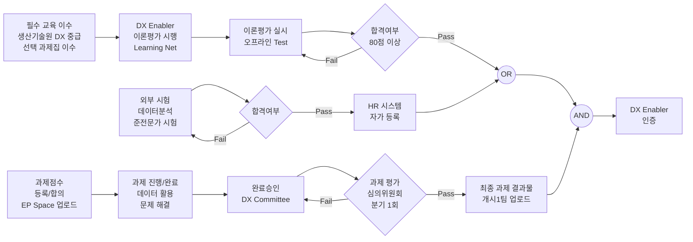
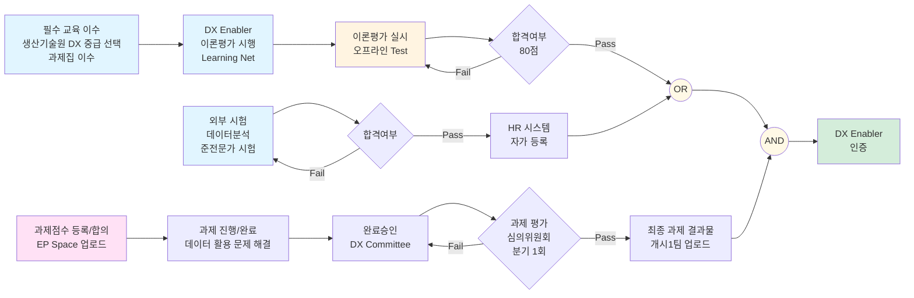

# 이미지 순서도를 피그마로 그리기

**날짜**: 2026-01-26 23:47

---

## Human (Message 1)

이미지의 순서도를 피그마로 그려줘

## Claude (Message 2)

사용자가 업로드한 이미지를 보고 그 내용을 Figma로 다이어그램으로 그려달라고 요청하고 있습니다. 먼저 이미지를 확인해야 합니다.

이미지를 보니 한국어로 작성된 플로우차트/프로세스 다이어그램입니다. 세 개의 주요 섹션으로 구성되어 있습니다:

1. **필수 교육 이수** (Required Training Completion)
   - 생산기술원 DX 중급 선택 과제집 이수
   - 인정 과정 List 유첨 참고

2. **이론 평가** (Theory Evaluation)
   - DX Enabler 이론평가 시행
   - Learning Net [생산기술원] Domain DX_DX Enabler(Lv2)\_Test
   - 이론평가 실시: 오프라인 Test
   - 합격여부 (80점 이상) - Pass/Fail
   - 외부 시험: 해당 자격의 별도 인정에 따르며, 시험 응시료는 DX Enabler 인증 시 지원
   - 데이터분석 준전문가 시험
   - 합격여부
   - HR 시스템 자가 등록
   - OR 게이트
   - AND 게이트
   - DX Enabler 인증

3. **과제 평가** (Project Evaluation)
   - 과제점수(동록/합의)
   - 과제 등록 A EP 물품 진행 후
   - EP Space > 생산기술원 Domain DX 개시1팀 업로드
   - 과제 진행/완료: 데이터 활용 로제 해결
   - 완료승인: DX Committee
   - 과제 평가(심의위원회): 분기 1회
   - Pass/Fail
   - 최종 과제 결과물 개시1팀 업로드

이것은 DX Enabler 인증 프로세스를 나타내는 다이어그램으로, 교육 이수, 이론 평가, 과제 평가의 세 단계를 거쳐 최종 인증을 받는 구조입니다.

Mermaid.js 문법으로 변환하기 위해 flowchart를 활용하겠습니다. 한글 텍스트는 따옴표로 감싸고, LR 방향으로 설정하며, 조건 분기는 다이아몬드 모양({})으로, 프로세스는 사각형([])으로 표현할 예정입니다.이미지의 순서도를 Figma로 그려드리겠습니다. DX Enabler 인증 프로세스 플로우차트네요.

먼저 이미지를 확인하고 다이어그램을 생성하겠습니다.

```
This block is not supported on your current device yet.
```

좋습니다. 이미지를 확인했습니다. 이제 이 플로우차트를 Mermaid.js 구문으로 변환하여 Figma 다이어그램을 생성하겠습니다.

주요 구조:

1. 필수 교육 이수
2. 이론 평가 (두 개의 경로)
   - DX Enabler 이론평가
   - 데이터분석 준전문가 시험 (외부)
   - OR 게이트로 연결
3. 과제 평가
4. AND 게이트
5. DX Enabler 인증

각 단계를 명확하게 표현하고, 의사결정 포인트(다이아몬드)와 프로세스(사각형)를 구분하겠습니다.

```
This block is not supported on your current device yet.
```

Figma 연결이 끊어진 것 같습니다. 사용자에게 Figma 연결을 다시 해야 한다고 알려주고, 대신 Mermaid 코드를 제공하거나 다른 방법을 제안해야 합니다.Figma 연결이 끊어진 것 같습니다. Settings에서 Figma를 다시 연결해주시거나, 제가 Mermaid.js 코드를 제공해드릴 수 있습니다.

**옵션 1: Figma 재연결**
Settings에서 Figma MCP 서버를 다시 연결한 후 다시 시도

**옵션 2: Mermaid 코드 제공**
아래 코드를 복사하여 Mermaid Live Editor나 다른 도구에서 사용하실 수 있습니다:



**옵션 3: 다른 도구 사용**

- [Mermaid Live Editor](https://mermaid.live/)에서 직접 편집
- Notion이나 다른 도구에서 Mermaid 다이어그램으로 삽입

어떤 방법을 선호하시나요?

## Human (Message 3)

피그마에 붙여 넣을 수 있는 코드형태로 제공하고, 코드를 어떻게 피그마에 입력하면 좋을지 가이드 해줘:

## Claude (Message 4)

사용자가 Figma에 직접 붙여넣을 수 있는 형태의 코드를 원하고 있습니다. Figma는 직접 Mermaid 코드를 지원하지 않지만, 몇 가지 방법이 있습니다:

1. Figma 플러그인 사용 (Mermaid Chart, Diagram 등)
2. SVG로 변환해서 붙여넣기
3. 이미지로 변환해서 붙여넣기

가장 실용적인 방법을 안내해드리겠습니다.Figma에서 다이어그램을 만드는 **가장 쉬운 3가지 방법**을 안내해드리겠습니다:

## 🎯 방법 1: Mermaid Chart 플러그인 (추천)

### 설치 방법

1. Figma에서 `Ctrl + /` (또는 `Cmd + /`)
2. "Plugins" 검색 → "Mermaid Chart" 설치
3. 플러그인 실행 후 아래 코드 붙여넣기

### 코드



---

## 🎯 방법 2: FigJam + Mermaid (더 간단)

FigJam에서는 Mermaid를 네이티브로 지원합니다!

### 사용 방법

1. **FigJam 열기** (Figma 내 FigJam 모드)
2. `/diagram` 입력
3. "Mermaid diagram" 선택
4. 위의 코드 붙여넣기
5. 완성 후 Figma로 복사 가능

---

## 🎯 방법 3: 온라인 변환 → SVG 붙여넣기

### 단계별 가이드

**1단계: Mermaid Live Editor에서 생성**

```
https://mermaid.live/
```

위 사이트에 접속 → 아래 코드 붙여넣기

**2단계: 붙여넣을 코드**


**3단계: SVG 다운로드**

- "Actions" 버튼 → "Download SVG" 클릭

**4단계: Figma에 Import**

- Figma에서 `Ctrl + Shift + K` (Place Image/Video)
- 다운로드한 SVG 파일 선택
- 드래그해서 크기 조정

---

## 📋 각 방법의 장단점

| 방법                       | 장점                                 | 단점               | 추천도     |
| -------------------------- | ------------------------------------ | ------------------ | ---------- |
| **Mermaid Chart 플러그인** | 코드로 직접 편집 가능, 업데이트 쉬움 | 플러그인 설치 필요 | ⭐⭐⭐⭐⭐ |
| **FigJam Mermaid**         | 가장 빠름, 네이티브 지원             | FigJam 사용 필요   | ⭐⭐⭐⭐   |
| **SVG Import**             | 플러그인 불필요, 즉시 사용           | 수정이 어려움      | ⭐⭐⭐     |

---

## 🎨 색상 커스터마이징 팁

코드 하단에 스타일을 추가하면 색상 변경 가능:

```mermaid
style A fill:#e1f5ff,stroke:#0066cc,stroke-width:2px
style O fill:#d4edda,stroke:#28a745,stroke-width:3px
style H fill:#fff9e6,stroke:#ffc107,stroke-width:2px
style N fill:#fff9e6,stroke:#ffc107,stroke-width:2px
```

어떤 방법이 가장 편하실 것 같으신가요? 제가 더 상세히 도와드릴 부분이 있으면 말씀해주세요! 😊

## Human (Message 5)

이 내용을 캔바에서 구현하는 방법은?

## Claude (Message 6)

사용자가 Canva에서 이 다이어그램을 구현하는 방법을 묻고 있습니다. Canva는 Figma와 다른 도구이고, 제가 Canva MCP 도구를 사용할 수 있습니다.

Canva에서는 플로우차트나 다이어그램을 직접 그리거나, 템플릿을 사용하거나, 혹은 제가 직접 생성할 수 있습니다.

사용자의 요청을 보면:

1. DX Enabler 인증 프로세스 플로우차트를 Canva에서 만들고 싶어함
2. 여러 단계와 의사결정 노드, OR/AND 게이트가 있는 복잡한 플로우차트

Canva 도구로 할 수 있는 것:

- generate-design으로 플로우차트/다이어그램 생성 시도
- 또는 사용자에게 Canva에서 수동으로 만드는 방법 안내

먼저 generate-design을 사용해서 플로우차트를 만들어보는 것이 좋을 것 같습니다. design_type으로는 "infographic"이나 "presentation"을 사용할 수 있을 것 같습니다.

하지만 복잡한 플로우차트의 경우 Canva의 AI 생성이 완벽하지 않을 수 있으므로, 수동 작성 방법도 함께 안내하는 것이 좋겠습니다.Canva에서 이 플로우차트를 구현하는 **3가지 방법**을 안내해드리겠습니다!

## 🎯 방법 1: Canva AI로 자동 생성 (가장 빠름)

제가 지금 바로 Canva에서 이 플로우차트를 생성해드릴 수 있습니다!

```
This block is not supported on your current device yet.
```

좋습니다! Canva에서 4개의 디자인 후보가 생성되었습니다. 이제 사용자에게 이 옵션들을 보여주고, 추가로 Canva에서 수동으로 만드는 방법도 안내해드려야 합니다.## ✅ 완성! Canva에서 4가지 디자인이 생성되었습니다

아래 링크에서 마음에 드는 디자인을 선택하세요:

### 옵션 1


[디자인 보기](https://www.canva.com/d/cLnVaZlDqZ3LK4b)

### 옵션 2


[디자인 보기](https://www.canva.com/d/eQ7M8Nrv9EOBB-N)

### 옵션 3


[디자인 보기](https://www.canva.com/d/6-0NdfAMf8YcWSo)

### 옵션 4


[디자인 보기](https://www.canva.com/d/JWKukGEjzsihour)

---

## 🎨 방법 2: Canva 템플릿에서 수동 편집

### 단계별 가이드

**1. Canva에서 플로우차트 템플릿 검색**

```
1. Canva.com 접속
2. 검색창에 "flowchart" 또는 "프로세스 플로우" 입력
3. 마음에 드는 템플릿 선택
```

**2. 요소 추가 방법**

- **사각형 박스**: Elements → Shapes → Rectangle
- **다이아몬드(결정)**: Elements → Shapes → Diamond
- **원형(게이트)**: Elements → Shapes → Circle
- **화살표**: Elements → Lines & Arrows

**3. 텍스트 편집**
각 도형을 더블클릭해서 텍스트 입력:

- 필수 교육 이수
- DX Enabler 이론평가 시행
- 이론평가 실시
- 합격여부 (80점)
- 외부 시험
- 과제점수 등록/합의
- 등...

**4. 색상 적용**

- 파란색: 교육/이론 단계
- 주황색: 평가 단계
- 핑크: 과제 단계
- 초록색: 최종 인증
- 노란색: OR/AND 게이트

---

## 🎯 방법 3: Canva Whiteboard 활용

Canva의 화이트보드 기능을 사용하면 더 자유롭게 다이어그램 작성 가능:

```
1. Canva → "Whiteboard" 선택
2. 좌측 "Elements" → "Flowchart" 카테고리
3. 미리 만들어진 플로우차트 요소 드래그
4. 연결선으로 요소 연결
```

---

## 💡 Canva 플로우차트 작성 팁

### 배치 구조

```
왼쪽 → 오른쪽 흐름으로 배치:

[필수교육] → [이론평가] → [OR] → [AND] → [인증]
              ↓          ↗
           [외부시험]

           [과제평가] → [AND]
```

### 정렬 기능 활용

- 여러 요소 선택 → 우클릭 → "Align" 선택
- "Distribute horizontally/vertically" 로 균등 배치

### 레이어 순서

- 연결선을 박스 뒤로: 우클릭 → "Send to back"
- 텍스트를 앞으로: 우클릭 → "Bring to front"

---

## 📊 비교표

| 방법             | 속도   | 자유도     | 추천 상황           |
| ---------------- | ------ | ---------- | ------------------- |
| **AI 자동 생성** | ⚡⚡⚡ | ⭐⭐       | 빠르게 초안 필요    |
| **템플릿 편집**  | ⚡⚡   | ⭐⭐⭐⭐   | 세밀한 커스터마이징 |
| **화이트보드**   | ⚡     | ⭐⭐⭐⭐⭐ | 자유로운 협업 작업  |

---

위에서 생성된 4개의 디자인 중 마음에 드는 것이 있으신가요?

선택하신 디자인을 제가 Canva 계정에 추가하고, 추가 편집도 도와드릴 수 있습니다! 😊

예: "옵션 2를 내 Canva에 저장해줘" 라고 말씀해주시면 바로 처리해드립니다.

## Human (Message 7)

조금 색상사용을 자제하고 격식이 있어보이는 톤으로 수정제안

## Claude (Message 8)

사용자가 생성된 Canva 디자인의 색상을 자제하고 더 격식있는 톤으로 수정을 원하고 있습니다.

Canva에서는 한번 생성된 디자인을 직접 수정하는 API가 없으므로, 새로운 쿼리로 다시 generate-design을 호출해야 합니다.

이번에는:

- 색상 사용 최소화
- 격식있고 프로페셔널한 톤
- 비즈니스/기업용 스타일
- 모노톤 또는 제한된 색상 팔레트
- 깔끔하고 정돈된 레이아웃

이런 요소들을 쿼리에 반영해야 합니다.네, 더 격식있고 프로페셔널한 톤으로 다시 생성해드리겠습니다!

```
This block is not supported on your current device yet.
```

좋습니다. 더 격식있고 프로페셔널한 스타일의 디자인이 생성되었습니다. 사용자에게 결과를 보여드리고, 어떤 차이가 있는지 설명해드려야겠습니다.## ✅ 격식있는 프로페셔널 버전 완성!

색상을 자제하고 비즈니스 문서 스타일로 재생성했습니다. 아래에서 선택해주세요:

### 옵션 1 (모던 미니멀)


[디자인 보기](https://www.canva.com/d/QBc4agJZrITGSaw)

### 옵션 2 (클래식 프로페셔널)


[디자인 보기](https://www.canva.com/d/6FrU767ep8Dq0ga)

### 옵션 3 (깔끔한 기업용)


[디자인 보기](https://www.canva.com/d/mAPjgz38mkJwRBd)

### 옵션 4 (정돈된 공식 문서)


[디자인 보기](https://www.canva.com/d/tyCshp9sskwZyI_)

---

## 🎨 개선된 디자인 특징

### 이전 버전 vs 새 버전

| 요소       | 이전 (컬러풀)                  | 현재 (프로페셔널)                    |
| ---------- | ------------------------------ | ------------------------------------ |
| **색상**   | 파랑, 주황, 핑크, 초록 등 다양 | 블랙, 그레이, 화이트 + 네이비 포인트 |
| **톤**     | 친근하고 캐주얼                | 격식있고 공식적                      |
| **용도**   | 프레젠테이션, 교육자료         | 임원 보고, 공식 문서, 제안서         |
| **스타일** | 인포그래픽                     | 비즈니스 다이어그램                  |

---

## 💼 추가 수정 옵션

마음에 드는 디자인을 선택하신 후, 다음과 같은 추가 조정도 가능합니다:

### 1️⃣ 색상 완전 제거 (흑백 버전)

```
"완전히 흑백으로 만들어줘"
```

### 2️⃣ 회사 브랜드 컬러 적용

```
"네이비 대신 [회사 색상 코드]로 바꿔줘"
```

### 3️⃣ 레이아웃 변경

```
"세로 방향으로 바꿔줘" 또는 "더 간결하게 만들어줘"
```

### 4️⃣ 폰트 스타일 조정

```
"더 굵은 폰트로", "산세리프 대신 세리프체로"
```

---

어떤 버전이 가장 마음에 드시나요? 선택하신 후 추가 수정사항을 말씀해주시면 바로 반영해드리겠습니다! 😊

**예시**: "옵션 2를 선택하고, 내 Canva 계정에 저장해줘"

---

_Archived from: `0f9466bb-79d5-44e2-bdc7-4ca348f35602.json`_
